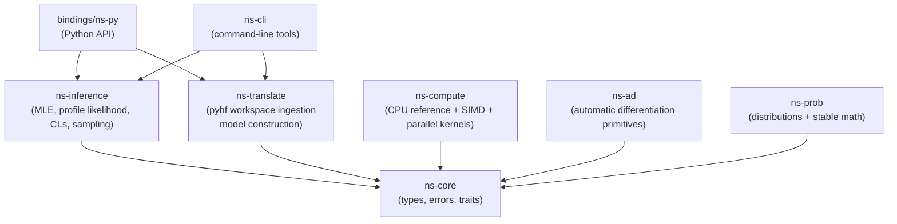

# NextStat White Paper

Version: 0.1.0 (Draft)  
Last updated: 2026-02-06  
Status: Technical draft (public-facing)

## Abstract

NextStat is a high-performance statistical inference toolkit implemented in Rust with Python bindings and a CLI. It spans two major use-cases:

- **Binned likelihood inference** via pyhf JSON / HistFactory workspaces (HEP and adjacent sciences), with deterministic parity testing against pyhf in a CPU reference mode.
- **General statistics workflows** (regression, multilevel/hierarchical models, and time series/state space) built on a shared `LogDensityModel` contract, plus baseline econometrics/causal inference and PK/NLME packs.

NextStat provides a fast, reproducible engine for likelihood evaluation, maximum-likelihood fits, profile likelihood scans, asymptotic CLs limits, Bayesian posterior sampling (NUTS), and linear-Gaussian state-space inference (Kalman filtering/smoothing, EM parameter estimation, and forecasting with prediction intervals). The project is designed around a deterministic validation path and an optimized performance path (SIMD, parallelism) without breaking the reference contract.

This paper describes the motivation, mathematical foundations, system architecture, inference algorithms, validation methodology, and benchmark strategy for NextStat.

## Documentation map

- Tutorials: `docs/tutorials/README.md`
- Python API reference: `docs/references/python-api.md`
- Rust API reference: `docs/references/rust-api.md`
- CLI reference: `docs/references/cli.md`
- Configuration format: `docs/references/analysis-config.md`

## 1. Motivation

Many scientific and applied domains rely on repeated inference tasks under a well-defined likelihood:

- Regression and generalized linear models (GLMs)
- Multilevel / hierarchical models (random effects, partial pooling)
- Time series and state-space models (forecasting, missing observations)
- Large binned likelihood analyses (HistFactory family) and derived workflows

In high-energy physics, pyhf provides an established Python-first reference implementation for HistFactory-style workspaces and a wide ecosystem. In other fields (pharma, social sciences, ML research), tools like statsmodels and probabilistic programming languages provide rich modeling surfaces. Across all of these, workflows are often dominated by compute-heavy likelihood evaluations and repeated optimization / sampling.

NextStat aims to provide:

- A fast and scalable engine implemented in Rust
- A stable, reproducible validation baseline (deterministic reference mode)
- A unified model contract (`LogDensityModel`) so inference algorithms generalize
- Multiple front-ends: Rust library, Python package, and CLI artifacts suitable for pipelines

## 2. Scope and Non-Goals

### 2.1 In scope (v0.x)

- HistFactory-style binned likelihoods via pyhf JSON workspaces
- Canonical objective parity with pyhf in deterministic CPU mode (for supported workflows)
- Generic inference over any `LogDensityModel`:
  - MLE/MAP with parameter bounds (L-BFGS-B style constraints)
  - NUTS sampling (single-chain and multi-chain)
- General statistics pack:
  - GLMs: linear, logistic, Poisson, negative binomial
  - Composition builder for GLM-style models (including random intercepts/slopes)
- Econometrics / causal pack:
  - Robust/cluster standard errors, panel FE baseline
  - DiD/event-study helpers, IV/2SLS baseline, doubly-robust AIPW baseline
- Time series pack:
  - Linear-Gaussian Kalman filter + RTS smoother + log-likelihood
  - EM parameter estimation for standard models
  - Forecasting APIs with Gaussian prediction intervals
- Pharmacometrics pack:
  - 1-compartment oral PK baseline (closed-form concentration)
  - NLME baseline with log-normal random effects (diagonal Omega)
- A deterministic validation path and a performance path (SIMD / parallelism)

### 2.2 Non-goals (near-term)

- Exact duplication of every pyhf backend and feature
- Full numerical identity across all parallel backends and hardware (GPU/threads)
- Replacing analysis frameworks or end-user modeling tools
- Full drop-in replacement for the entire statsmodels surface area (parity tests are selective and often optional)

## 3. Compatibility Target: pyhf JSON / HistFactory

The primary compatibility target is the pyhf JSON schema for HistFactory-style workspaces. In practical terms, NextStat aims to:

- Parse pyhf JSON workspaces and build an internal model representation
- Match pyhf’s canonical objective (`logpdf` and `twice_nll`) for fixtures in deterministic mode
- Provide pyhf-compatible surfaces for common frequentist workflows:
  - fit
  - profile scan
  - asymptotic CLs hypotest
  - observed/expected upper limits (Brazil band)

## 4. Mathematical Foundations

NextStat uses the same canonical terminology as the project standards:

- `logpdf(theta)`: log-likelihood including constraint terms
- `nll(theta) = -logpdf(theta)`
- `twice_nll(theta) = 2 * nll(theta) = -2 * logpdf(theta)`

The baseline binned likelihood is constructed from:

- Poisson terms for observed counts per bin, given model expectations
- Constraint terms for nuisance parameters (e.g., Gaussian constraints)
- Optional auxiliary terms (e.g., Barlow-Beeston-like constructions)

The canonical objective and tolerances are enforced by the deterministic CPU validation suite (parity vs pyhf) and documented as internal standards.

## 5. Inference Algorithms

### 5.1 Maximum Likelihood Estimation (MLE)

NextStat performs MLE with bounded parameters using a quasi-Newton method (L-BFGS with box constraints). The implementation is designed to support:

- Deterministic CPU reference evaluation (for parity tests)
- Gradient-based optimization when analytic gradients are available
- A fallback path when gradients are unavailable (early development or feature-gated backends)

The fit output exposes best-fit parameters, objective at the minimum, and Hessian-based parameter uncertainties. When the full covariance is numerically stable (positive variances), it is returned; otherwise NextStat falls back to a diagonal-curvature estimate for uncertainties and omits the covariance matrix.

### 5.2 Profile Likelihood Scan and Test Statistics

For upper-limit workflows and hypothesis testing, NextStat computes pyhf-style profile likelihood test statistics:

- Unconditional (free) fit: best-fit POI and nuisance parameters
- Conditional fit: POI fixed to a tested value, nuisance parameters profiled
- Test statistics: `q_mu` and `qtilde_mu` following Cowan et al.

These are exposed through Rust, Python, and CLI surfaces, with golden parity tests against pyhf at selected points.

### 5.3 Asymptotic CLs Hypotest and Upper Limits

NextStat implements asymptotic CLs calculations consistent with pyhf’s asymptotic calculator behavior for `test_stat="qtilde"`. This includes:

- Observed CLs, CLs+b, CLb
- Expected CLs set (Brazil band) under the Asimov model
- Root-finding or scan+interpolation methods for upper limits

### 5.4 Bayesian Sampling (Optional)

NextStat is designed to support Bayesian workflows without breaking the frequentist parity baseline. The standards define a posterior contract:

- Constraints are already included in `model.logpdf` (pyhf parity baseline)
- Bayesian mode adds only an explicit additional prior to avoid double counting

The long-term goal is HMC/NUTS in Rust core, with reproducible seeds and diagnostics (R-hat, ESS, divergences), and golden tests on toy distributions.

### 5.5 State Space Inference (Kalman / RTS / EM)

For linear-Gaussian state-space models, NextStat provides:

- Kalman filtering with log-likelihood accumulation
- RTS smoothing for posterior state trajectories
- EM parameter estimation for standard models (e.g., local level, AR(1))
- Out-of-sample forecasting with Gaussian prediction intervals

Missing observations are supported via a per-component missingness policy (skipping the update step for missing dimensions).

## 6. System Architecture

NextStat follows a clean-architecture style: inference depends on stable abstractions, while compute backends provide implementations.



Key design principles:

- Deterministic CPU mode for validation and parity testing
- Explicit separation between model translation and inference logic
- Backends can evolve (SIMD, threading, future GPU) without invalidating the reference contract

## 7. Validation and Quality Assurance

### 7.1 Parity vs pyhf (deterministic mode)

Parity tests are run in a deterministic CPU mode with fixed summation order, fixed seeds, and controlled threading. The Phase 1 parity contract targets:

- `twice_nll`: strict `rtol/atol` for fixtures
- Best-fit parameters and uncertainties: per-parameter comparisons with defined tolerances

### 7.2 Golden points for higher-level inference

For profile likelihood and CLs workflows, NextStat uses golden point tests:

- Compare test statistics (`q_mu`/`qtilde_mu`) at selected POI points vs pyhf
- Compare CLs values and upper limits (within tolerance)

### 7.3 Bias / pull / coverage regressions (toys)

Parity at single points is not sufficient to ensure statistical quality. NextStat uses toy ensembles to measure:

- Bias: `E[theta_hat] - theta_true`
- Pull mean/std: `(theta_hat - theta_true) / sigma_hat`
- Coverage for 1 sigma and 2 sigma intervals (baseline Hessian-based intervals)

The project policy is that NextStat must not silently diverge from pyhf’s statistical behavior; any correction must be explicit, validated, and documented.

### 7.4 Cross-domain validation (general stats + time series)

Beyond HistFactory parity, NextStat maintains:

- Deterministic golden fixtures for regression models (OLS/logistic/Poisson), including gradient checks at fixture optima.
- Hierarchical model contract tests (random intercept/slope and correlated random effects) across Rust and Python surfaces.
- Kalman filter parity tests against independent scalar references (and optional parity vs statsmodels when available).

### 7.5 Apex2 reproducibility pipeline (one entry point)

NextStat bundles an "Apex2" validation harness that produces a machine-readable report and serves as a single command to run the core correctness gates.

- Orchestrator: `tests/apex2_master_report.py`
- Components (non-exhaustive): NUTS quality gates, HistFactory deterministic parity, ROOT profile-scan parity, and bias/pulls toy regressions.
- Deterministic JSON mode: `--deterministic` (omits timestamps/timings and uses stable ordering).
- "Goldens without heavy deps": selected reference outputs are checked in as JSON fixtures so parity regressions can run without requiring the full external stack at test time.

Sub-reports (runnable independently):

- pyhf parity/validation: `tests/apex2_pyhf_validation_report.py`
- NUTS quality gates: `tests/apex2_nuts_quality_report.py`
- Bias/pulls toy regressions (slow): `tests/apex2_bias_pulls_report.py`
- SBC (slow): `tests/apex2_sbc_report.py`
- ROOT suite/parity (optional; requires ROOT): `tests/apex2_root_suite_report.py`
- P6 GLM fit/predict benchmarks (optional): `tests/apex2_p6_glm_benchmark_report.py`

Example:

```bash
PYTHONPATH=bindings/ns-py/python ./.venv/bin/python tests/apex2_master_report.py \
  --deterministic \
  --nuts-quality --nuts-quality-strict
```

## 8. Performance and Benchmarks

Performance goals focus on the dominant costs in typical workflows:

- Likelihood evaluation throughput (NLL and expected data)
- Gradient/Hessian evaluation overhead (once analytic gradients exist)
- End-to-end fit time (MLE) and repeated fits (scan, toys, ranking)

Benchmarks are implemented using Criterion for Rust components and a Python benchmark script for direct comparisons against pyhf.

### 8.1 Benchmark Suites and Entry Points

Recommended benchmarking practices:

- Pin CPU frequency scaling where possible
- Run both deterministic mode (correctness baseline) and performance mode
- Report medians and variability (not single runs)

Benchmark entry points (non-exhaustive):

- Rust Criterion: `cargo bench --workspace`
- Time series benches: `cargo bench -p ns-inference --bench kalman_benchmark`
- Hierarchical benches: `cargo bench -p ns-inference --bench hier_benchmark`
- Python microbench (no external deps): `.venv/bin/python tests/bench/python_microbench.py`

### 8.2 Indicative Results (Reference Machine)

The numbers below are intended as an **indicative baseline** and a regression target. They are not a performance contract.

Reference machine (Apex2 baseline env):

- CPU: Apple M5 (arm64)
- OS: macOS 26.2
- Rust: 1.93.0
- Python: 3.13.11
- pyhf: 0.7.6
- nextstat: 0.1.0

Data sources:

- HistFactory and GLM tables: `tests/record_baseline.py` (writes machine-readable JSON under `tmp/baselines/` with full environment + git commit).
- EM table: `cargo bench -p ns-inference --bench em_benchmark -- --quick --exact ...`

#### HistFactory NLL Throughput (Python API)

These timings include Python overhead (pyhf and NextStat extension calls). For Rust-only micro-benchmarks, use `cargo bench`.

| Model | Main bins | pyhf NLL (us) | NextStat NLL (us) | Speedup | max abs delta NLL |
|------:|----------:|--------------:|------------------:|--------:|------------------:|
| fixture_simple | 2 | 28.22 | 2.48 | 11.36x | 5.68e-13 |
| fixture_complex | 4 | 67.17 | 4.94 | 13.59x | 9.09e-13 |
| zoo_multichannel_3 | 9 | 30.51 | 7.97 | 3.83x | 2.73e-12 |
| synthetic_shapesys_16 | 16 | 27.71 | 10.81 | 2.56x | 5.00e-12 |
| synthetic_shapesys_256 | 256 | 50.92 | 155.62 | 0.33x | 1.71e-10 |

Notes:

- `synthetic_shapesys_*` is dominated by ShapeSys gamma terms; optimization is ongoing and performance may be sensitive to modifier mix.
- All rows above satisfy the deterministic parity contract (delta shown is absolute NLL delta).

#### GLM Fit/Predict Timing (Python High-Level API, p=20)

| Family | n | fit (ms) | predict (ms) |
|------:|--:|---------:|-------------:|
| linear | 200 | 7.67 | 0.28 |
| logistic | 200 | 16.83 | 0.30 |
| poisson | 200 | 11.07 | 0.26 |
| negbin | 200 | 48.85 | 0.26 |
| linear | 20000 | 450.86 | 25.40 |
| logistic | 20000 | 1469.55 | 25.11 |
| poisson | 20000 | 322.32 | 24.72 |
| negbin | 20000 | 373.19 | 25.71 |

#### State-Space EM Timing (Rust Criterion, Fixed Iterations)

Criterion reports total time for the configured iteration count. Approximate per-iteration time is derived as `total / iters`.

| Model | n | d | iters | total (ms) | approx per iter (ms) |
|------:|--:|--:|-----:|-----------:|----------------------:|
| local level | 100 | 1 | 5 | 0.662 | 0.132 |
| local level | 1000 | 1 | 5 | 6.529 | 1.306 |
| AR(1) | 100 | 1 | 5 | 0.684 | 0.137 |
| AR(1) | 1000 | 1 | 5 | 6.621 | 1.324 |

These numbers were collected with Criterion `--quick` and should be used for smoke/regression detection, not publication-quality comparisons.

## 9. Domain Packs and Applied Workflows

NextStat is designed as a core inference engine plus domain-oriented packs. The near-term goal is not to cover every model, but to deliver a small set of **high-quality, reproducible primitives per domain**, with a shared validation and benchmark harness.

### 9.1 Statistics and ML Workflows (Available)

**Regression and GLMs.** NextStat provides a production-usable GLM surface in Python for common families, with deterministic golden fixtures and optional parity checks against external references:

```python
from nextstat import glm

fit = glm.linear.fit(x, y, include_intercept=True)
pred = fit.predict(x_new)

fit = glm.logistic.fit(x, y01, l2=1.0)  # ridge/MAP recommended for separability
proba = fit.predict_proba(x_new)
```

**Multilevel / hierarchical models.** Hierarchical models are exposed via compositional model building blocks and a shared `LogDensityModel` contract, enabling MLE/MAP and NUTS sampling without model-specific inference code.

```python
import nextstat

model = nextstat._core.ComposedGlmModel.logistic_regression(
    x, y01, include_intercept=True,
    coef_prior_mu=0.0, coef_prior_sigma=1.0,
)
fit = nextstat.fit(model)
```

**Time series / state space.** For linear-Gaussian models, NextStat provides Kalman filtering/smoothing, EM parameter estimation for standard models, and forecasting with prediction intervals.

```python
import nextstat

model = nextstat.timeseries.local_level_model(q=0.1, r=0.2, m0=0.0, p0=1.0)
fit = nextstat.timeseries.kalman_fit(model, ys, max_iter=5, tol=1e-9, forecast_steps=12)
artifact = nextstat.timeseries.kalman_viz_artifact(fit, ys, level=0.9)
```

### 9.2 Survival Analysis Pack (Phase 9.A, Baseline Available)

Primary target: **time-to-event endpoints** with censoring and a clear reproducibility contract suitable for regulated workflows.

Baseline scope (currently implemented as core models; higher-level fit helpers may evolve):

- Parametric survival models with right censoring: exponential, Weibull, log-normal AFT.
- Cox proportional hazards via partial likelihood with explicit ties policy (Breslow/Efron).

Explicit assumptions (v1 baseline):

- Deterministic handling of ties and censoring policy is part of the public contract (documented and tested).
- Validation includes golden fixtures and simulation-based checks (bias/pull/coverage), plus parity comparisons where an independent reference exists.

Example (low-level model + generic optimizer):

```python
import nextstat

times = [2.0, 1.0, 1.0, 0.5]
events = [True, True, False, True]  # False = right-censored
x = [[1.0, 0.0], [0.0, 1.0], [1.0, 1.0], [1.0, -1.0]]

model = nextstat.CoxPhModel(times, events, x, ties="efron")
fit = nextstat.fit(model)
print(fit.params)
```

### 9.3 Social Sciences Pack (Phase 9.C, Partial)

Primary target: **ordinal outcomes**, missing data policies, and causal diagnostics that make common applied workflows easier to reproduce and review.

Baseline scope:

- Ordinal logistic/probit (ordered outcomes) with clear link functions and diagnostics.
- Missing data policy and measurement error baseline (explicit assumptions; deterministic behavior).
- Causal helpers: propensity score estimation + weighting/matching diagnostics (as a convenience layer, not a claim of causal identification).

Current status:

- Implemented: ordered logistic regression (proportional odds) baseline via `nextstat.ordinal.ordered_logit`.

API sketch:

```python
from nextstat import ordinal

fit = ordinal.ordered_logit.fit(x, y_ord, n_levels=5)
proba = fit.predict_proba(x_new)
```

### 9.4 Reproducible Reporting Artifacts (Phase 9.R, Planned)

Beyond numeric parity, regulated and cross-team workflows need **auditable artifacts**. The intent is to provide a minimal, open-core-compatible baseline:

- Model spec artifact: parameter names/bounds, objective contract, algorithm settings
- Data fingerprint: hashes and shape summaries (no raw data required)
- Environment fingerprint: versions, git commit, platform, CPU, determinism settings, seeds

This package is designed to pair naturally with Apex2 baselines and validation reports, and to support a future audit trail layer (open-core boundary aware).

## 10. Reproducibility

Reproducibility is treated as a first-class feature:

- Deterministic CPU reference path (single-thread or deterministic reductions)
- Explicit seeds for toy generation and sampling
- Version-pinned toolchain and dependencies (Rust toolchain pin + `Cargo.lock`)

## 11. Licensing and Open-Core Boundaries

NextStat uses dual licensing:

- Open Source: AGPL-3.0-or-later
- Commercial: LicenseRef-Commercial

The intended open-core boundary is documented in `docs/internal/legal/open-core-boundaries.md` (draft, requires counsel review). The principle is:

- OSS includes everything required for correct statistical inference, reproducibility, and baseline workflows
- Commercial features add enterprise value around auditability, orchestration, compliance reporting, and collaboration

## 12. Roadmap (High Level)

At a high level (implementation phases):

- Phase 0–4: foundations, parity, performance paths, hardening
- Phase 5: general statistics core (universal model API)
- Phase 6: regression & GLM pack
- Phase 7: hierarchical / multilevel models
- Phase 8: time series & state space (Kalman/RTS/EM/forecasting)
- Phase 9: pharma + social sciences packs (survival, ordinal, longitudinal, reproducibility artifacts)
- Phase 10: benchmarks & performance coverage (including time series and hierarchical benches)

The detailed phase plan is maintained as an internal document set (not published in this repository).

At a high level:

- Phase 0: repository hygiene, CI, packaging scaffolding
- Phase 1: pyhf JSON ingestion + NLL parity + MLE + Python/CLI surfaces
- Phase 2A: CPU performance (SIMD and parallelism)
- Phase 2B: autodiff and gradients
- Phase 2C: optional GPU backends (feature-gated)
- Phase 3: production hardening, visualization, expanded validation, release discipline
- Phase 4: enterprise features (if pursuing open-core)

## References

- Cowan, Cranmer, Gross, Vitells. "Asymptotic formulae for likelihood-based tests of new physics." arXiv:1007.1727.
- pyhf project (HistFactory in pure Python): https://github.com/scikit-hep/pyhf
- HistFactory (ROOT) background and conventions: https://cds.cern.ch/record/1456844
