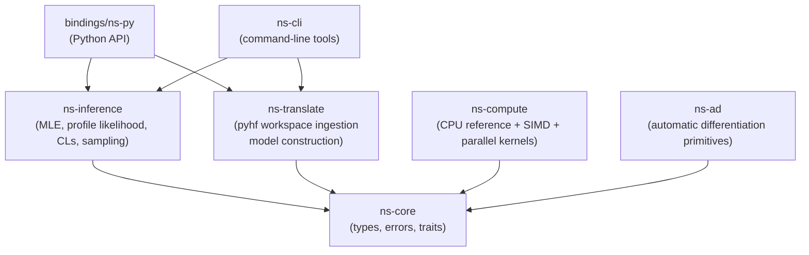

# NextStat White Paper

Version: 0.1.0 (Draft)  
Last updated: 2026-02-05  
Status: Technical draft (public-facing)

## Abstract

NextStat is a high-performance statistical inference toolkit for High Energy Physics (HEP), implemented in Rust with Python bindings. It targets compatibility with pyhf JSON (HistFactory-style workspaces) and provides a fast, reproducible engine for likelihood evaluation, maximum-likelihood fits, profile likelihood scans, and asymptotic CLs limits. NextStat is designed around a deterministic CPU reference path for validation and a performance path that can exploit SIMD and parallelism without breaking the parity contract.

This paper describes the motivation, mathematical foundations, system architecture, inference algorithms, validation methodology, and benchmark strategy for NextStat.

## 1. Motivation

Modern HEP analyses rely on large parameterized likelihood models (HistFactory family) and repeated inference tasks:

- Maximum likelihood fits (best-fit and covariance)
- Profile likelihood scans (test statistics as a function of the POI)
- Asymptotic CLs hypothesis tests and upper limits
- Large ensembles of toy experiments (bias/pull/coverage checks)

pyhf provides an established Python-first reference implementation and ecosystem integration. However, many workflows are dominated by compute-heavy likelihood evaluations and repeated fits. NextStat aims to provide:

- A fast and scalable engine implemented in Rust
- A stable, reproducible validation baseline (parity vs pyhf in deterministic CPU mode)
- Multiple front-ends: Rust library, Python package, and CLI

## 2. Scope and Non-Goals

### 2.1 In scope (v0.x)

- HistFactory-style binned likelihoods via pyhf JSON workspaces
- Canonical objective parity with pyhf in deterministic CPU mode:
  - `logpdf(theta)` and `twice_nll(theta) = -2 * logpdf(theta)`
- MLE with parameter bounds (L-BFGS-B style constraints)
- Profile likelihood scan and asymptotic test statistics (`q_mu` / `qtilde_mu`)
- Asymptotic CLs hypotest and upper limits (pyhf-style `test_stat="qtilde"`)
- A deterministic validation path and a performance path (SIMD / parallelism)

### 2.2 Non-goals (near-term)

- Exact duplication of every pyhf backend and feature
- Full numerical identity across all parallel backends and hardware (GPU/threads)
- Replacing analysis frameworks or end-user modeling tools

## 3. Compatibility Target: pyhf JSON / HistFactory

The primary compatibility target is the pyhf JSON schema for HistFactory-style workspaces. In practical terms, NextStat aims to:

- Parse pyhf JSON workspaces and build an internal model representation
- Match pyhf’s canonical objective (`logpdf` and `twice_nll`) for fixtures in deterministic mode
- Provide pyhf-compatible surfaces for common frequentist workflows:
  - fit
  - profile scan
  - asymptotic CLs hypotest
  - observed/expected upper limits (Brazil band)

## 4. Mathematical Foundations

NextStat uses the same canonical terminology as the project standards:

- `logpdf(theta)`: log-likelihood including constraint terms
- `nll(theta) = -logpdf(theta)`
- `twice_nll(theta) = 2 * nll(theta) = -2 * logpdf(theta)`

The baseline binned likelihood is constructed from:

- Poisson terms for observed counts per bin, given model expectations
- Constraint terms for nuisance parameters (e.g., Gaussian constraints)
- Optional auxiliary terms (e.g., Barlow-Beeston-like constructions)

The canonical objective and tolerances are specified in `docs/plans/standards.md`.

## 5. Inference Algorithms

### 5.1 Maximum Likelihood Estimation (MLE)

NextStat performs MLE with bounded parameters using a quasi-Newton method (L-BFGS with box constraints). The implementation is designed to support:

- Deterministic CPU reference evaluation (for parity tests)
- Gradient-based optimization when analytic gradients are available
- A fallback path when gradients are unavailable (early development or feature-gated backends)

The fit output exposes best-fit parameters, objective at the minimum, and (when requested) Hessian-based covariance and parameter uncertainties.

### 5.2 Profile Likelihood Scan and Test Statistics

For upper-limit workflows and hypothesis testing, NextStat computes pyhf-style profile likelihood test statistics:

- Unconditional (free) fit: best-fit POI and nuisance parameters
- Conditional fit: POI fixed to a tested value, nuisance parameters profiled
- Test statistics: `q_mu` and `qtilde_mu` following Cowan et al.

These are exposed through Rust, Python, and CLI surfaces, with golden parity tests against pyhf at selected points.

### 5.3 Asymptotic CLs Hypotest and Upper Limits

NextStat implements asymptotic CLs calculations consistent with pyhf’s asymptotic calculator behavior for `test_stat="qtilde"`. This includes:

- Observed CLs, CLs+b, CLb
- Expected CLs set (Brazil band) under the Asimov model
- Root-finding or scan+interpolation methods for upper limits

### 5.4 Bayesian Sampling (Optional)

NextStat is designed to support Bayesian workflows without breaking the frequentist parity baseline. The standards define a posterior contract:

- Constraints are already included in `model.logpdf` (pyhf parity baseline)
- Bayesian mode adds only an explicit additional prior to avoid double counting

The long-term goal is HMC/NUTS in Rust core, with reproducible seeds and diagnostics (R-hat, ESS, divergences), and golden tests on toy distributions.

## 6. System Architecture

NextStat follows a clean-architecture style: inference depends on stable abstractions, while compute backends provide implementations.

Key design principles:

- Deterministic CPU mode for validation and parity testing
- Explicit separation between model translation and inference logic
- Backends can evolve (SIMD, threading, future GPU) without invalidating the reference contract

## 7. Validation and Quality Assurance

### 7.1 Parity vs pyhf (deterministic mode)

Parity tests are run in a deterministic CPU mode with fixed summation order, fixed seeds, and controlled threading. The Phase 1 parity contract targets:

- `twice_nll`: strict `rtol/atol` for fixtures
- Best-fit parameters and uncertainties: per-parameter comparisons with defined tolerances

### 7.2 Golden points for higher-level inference

For profile likelihood and CLs workflows, NextStat uses golden point tests:

- Compare test statistics (`q_mu`/`qtilde_mu`) at selected POI points vs pyhf
- Compare CLs values and upper limits (within tolerance)

### 7.3 Bias / pull / coverage regressions (toys)

Parity at single points is not sufficient to ensure statistical quality. NextStat uses toy ensembles to measure:

- Bias: `E[theta_hat] - theta_true`
- Pull mean/std: `(theta_hat - theta_true) / sigma_hat`
- Coverage for 1 sigma and 2 sigma intervals (baseline Hessian-based intervals)

The project policy is that NextStat must not silently diverge from pyhf’s statistical behavior; any correction must be explicit, validated, and documented.

## 8. Performance and Benchmarks

Performance goals focus on the dominant costs in typical workflows:

- Likelihood evaluation throughput (NLL and expected data)
- Gradient/Hessian evaluation overhead (once analytic gradients exist)
- End-to-end fit time (MLE) and repeated fits (scan, toys, ranking)

Benchmarks are implemented using Criterion for Rust components and a Python benchmark script for direct comparisons against pyhf.

Recommended benchmarking practices:

- Pin CPU frequency scaling where possible
- Run both deterministic mode (correctness baseline) and performance mode
- Report medians and variability (not single runs)

## 9. Reproducibility

Reproducibility is treated as a first-class feature:

- Deterministic CPU reference path (single-thread or deterministic reductions)
- Explicit seeds for toy generation and sampling
- Version-pinned toolchain and dependencies (see `docs/plans/versions.md`)

## 10. Licensing and Open-Core Boundaries

NextStat uses dual licensing:

- Open Source: AGPL-3.0-or-later
- Commercial: LicenseRef-Commercial

The intended open-core boundary is documented in `docs/legal/open-core-boundaries.md` (draft, requires counsel review). The principle is:

- OSS includes everything required for correct statistical inference, reproducibility, and baseline workflows
- Commercial features add enterprise value around auditability, orchestration, compliance reporting, and collaboration

## 11. Roadmap (High Level)

For the executable plan and phase breakdown, see `docs/plans/README.md` and `docs/plans/2026-02-05-nextstat-implementation-plan.md`.

At a high level:

- Phase 0: repository hygiene, CI, packaging scaffolding
- Phase 1: pyhf JSON ingestion + NLL parity + MLE + Python/CLI surfaces
- Phase 2A: CPU performance (SIMD and parallelism)
- Phase 2B: autodiff and gradients
- Phase 2C: optional GPU backends (feature-gated)
- Phase 3: production hardening, visualization, expanded validation, release discipline
- Phase 4: enterprise features (if pursuing open-core)

## References

- Cowan, Cranmer, Gross, Vitells. "Asymptotic formulae for likelihood-based tests of new physics." arXiv:1007.1727.
- pyhf project (HistFactory in pure Python): https://github.com/scikit-hep/pyhf
- HistFactory (ROOT) background and conventions: https://cds.cern.ch/record/1456844

