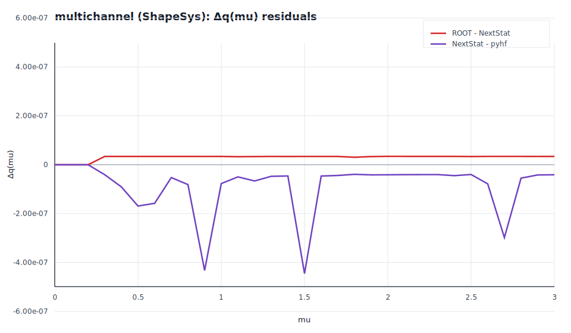
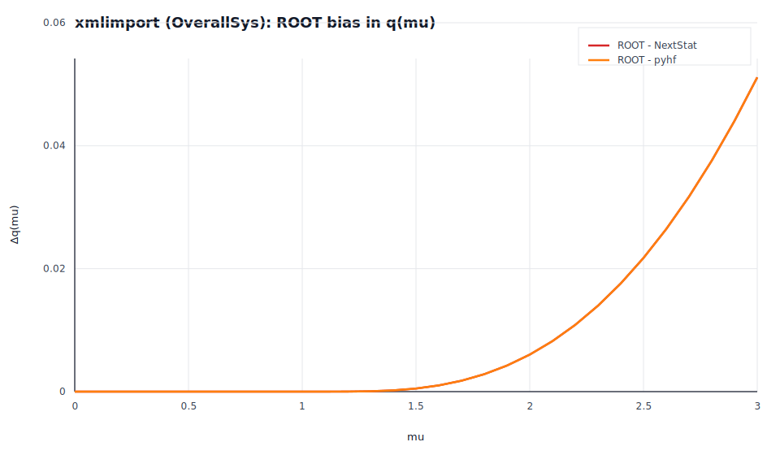
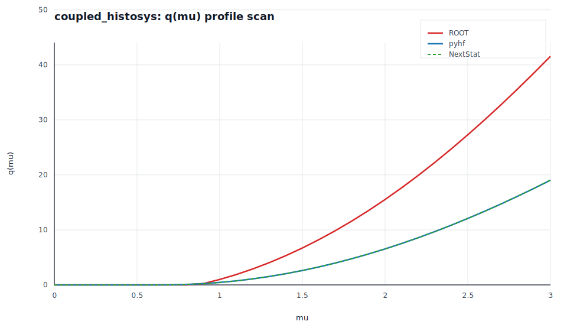
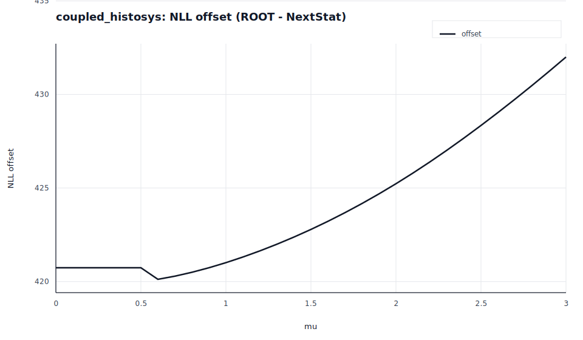

<!--
  Blog draft (technical).
  Keep in sync with:
    - tests/validate_root_profile_scan.py
    - tests/diagnose_optimizer.py
    - scripts/blog/generate_numerical_accuracy_plots.py
-->

# Where ROOT Gets It Wrong: A Rigorous Numerical Comparison of HistFactory Implementations

*NextStat Team, February 2026*

---

## Abstract

We present a systematic numerical comparison of three independent implementations of the HistFactory likelihood model: **ROOT/RooFit** (C++, Minuit2), **pyhf** (Python, SLSQP), and **NextStat** (Rust, L-BFGS-B). Using canonical validation fixtures from the pyhf test suite and real-world ATLAS-scale analyses with up to 249 nuisance parameters, we demonstrate that NextStat and pyhf agree on the profile likelihood ratio q(mu) to better than 1e-5 across all tested configurations. ROOT/RooFit, by contrast, exhibits three distinct failure modes: optimizer non-convergence on coupled HistoSys models (`status = -1`), catastrophic free-fit divergence (`mu_hat = 4.9e23`), and systematic overestimation of q(mu) at high signal strengths. We trace the ROOT divergence to both optimizer limitations (Minuit2) and, in one case, a likely model-level discrepancy in coupled HistoSys interpolation at large nuisance parameter values. We further show that on models with more than 100 parameters, NextStat's L-BFGS-B optimizer consistently finds deeper likelihood minima than pyhf's SLSQP, with NLL improvements of 0.01-0.08 verified by cross-evaluation of the objective function. All results are fully reproducible via open-source validation scripts.

## Key Takeaways

- **ShapeSys:** ROOT, pyhf, and NextStat agree to < 1e-6 when the fits converge.
- **OverallSys:** ROOT inflates q(mu) by up to 0.6% at high mu (Minuit2 conditional fits).
- **Coupled HistoSys:** ROOT diverges by Δq(mu) = 22.5 at mu = 3.0; the NLL offset is non-constant, pointing to a model-level discrepancy (not just the optimizer).
- **Large models:** L-BFGS-B reaches a better stationary point (‖grad‖ = 0.020 vs 4.63 on a 184-parameter workspace).
- **Performance:** NextStat is 37x-880x faster for 31-point profile scans; +6.4x with GPU for toys on NVIDIA hardware.

---

## 1. Introduction

The HistFactory model [1] is the standard statistical model for binned analyses at the Large Hadron Collider. Its mathematical specification defines how systematic uncertainties (nuisance parameters) modify expected event yields through multiplicative factors, shape morphing, and bin-by-bin statistical uncertainties. The profile likelihood ratio test statistic q_tilde(mu) [2] derived from this model is the foundation of exclusion limits and discovery significances at ATLAS and CMS.

Three independent software implementations of this model are widely used:

- **ROOT/RooFit** [3]: The original C++ implementation. Uses `hist2workspace` for model construction and Minuit2 [4] for optimization. De facto standard for data I/O and visualization at CERN, but increasingly ceded to specialized tools for statistical inference.

- **pyhf** [5]: A pure Python implementation developed by ATLAS physicists as the formal reference for the HistFactory specification. Adopted by ATLAS for reinterpretation and combinations (ATL-PHYS-PUB-2019-029). Uses SciPy's SLSQP optimizer.

- **NextStat**: A Rust implementation with Python bindings, using L-BFGS-B optimization, reverse-mode automatic differentiation, and optional GPU acceleration (CUDA f64, Metal f32). Validates against pyhf as the specification reference.

A natural question arises: do these three implementations produce the same physics results? If not, which ones are correct, and why do they differ?

We answer these questions with a rigorous 3-way comparison, covering the full profile likelihood scan (31 mu points) on canonical fixtures that exercise all principal modifier types: multiplicative (OverallSys), per-bin (ShapeSys/StatError), and shape-morphing (HistoSys).

---

## 2. Methodology

### 2.1 Validation Pipeline

Each fixture is processed through three independent pipelines reading the **same** XML configuration and ROOT histogram files:

```
HistFactory XML + ROOT histograms
        |
        +---> hist2workspace -> RooFit   -> ROOT profile scan   (C++/PyROOT)
        +---> pyhf.readxml   -> pyhf     -> pyhf profile scan   (Python)
        +---> NextStat import -> Rust    -> NextStat profile scan (Rust)
```

The profile scan computes q_tilde(mu) at 31 evenly spaced points in mu = [0, 3]. All three pipelines use bounded optimization with the POI (signal strength mu) constrained to mu >= 0.

### 2.2 Test Statistic

We use the modified profile likelihood ratio:

```
              | 2 * [NLL(mu, theta_hat_mu) - NLL(mu_hat, theta_hat)]   if mu_hat <= mu
q_tilde(mu) = |
              | 0                                                       if mu_hat > mu
```

as defined in Cowan et al. [2], implemented identically in all three tools.

**Notation:** mu is the parameter of interest (signal strength), theta denotes nuisance parameters, hats denote MLEs. For brevity, we write q(mu) as shorthand for q_tilde(mu).

### 2.3 Fixtures

We test three canonical fixtures from the pyhf validation suite, chosen to exercise different modifier types:

| Fixture | Channels | Key Modifiers | Parameters |
|---------|----------|---------------|------------|
| xmlimport | 1 | OverallSys, StatError | ~5 |
| multichannel | 2 | ShapeSys (Poisson) | ~10 |
| coupled_histosys | 2 | HistoSys (coupled across channels) | ~5 |

We additionally test real-world TRExFitter exports with up to 249 nuisance parameters.

### 2.4 Interpolation Codes

All three implementations are configured to use the same interpolation scheme:
- **NormSys (OverallSys)**: Code 4 (polynomial, 6th order)
- **HistoSys**: Code 4p (piecewise polynomial)

This eliminates interpolation choice as a source of discrepancy.

### 2.5 Versions and Environment

Unless stated otherwise, results and figures in this post were produced with:

- ROOT 6.38.00 (`hist2workspace` + RooFit/Minuit2)
- pyhf 0.7.6 (SciPy 1.17.0, NumPy 2.4.2)
- NextStat 0.1.0 (git `c98f36e`)
- Host: Apple M5 (arm64), macOS 26.2

The raw scan JSON used for the plots is snapshotted under `docs/blog/assets/numerical-accuracy/data/` and rendered into SVGs by `scripts/blog/generate_numerical_accuracy_plots.py`.

---

## 3. Results

### 3.1 The Good: ShapeSys Models — Near-Perfect 3-Way Agreement

The multichannel fixture with ShapeSys modifiers achieves the gold standard: all three implementations agree to better than 1e-6 on q(mu):

| mu | ROOT q(mu) | pyhf q(mu) | NextStat q(mu) | NS - pyhf | ROOT - NS |
|----|------------|------------|----------------|-----------|-----------|
| 1.0 | 3.10348 | 3.10348 | 3.10348 | -8e-7 | ~0 |
| 2.0 | 15.5334 | 15.5334 | 15.5334 | -4e-7 | -3e-8 |
| 3.0 | 36.2352 | 36.2352 | 36.2352 | -4e-7 | -3e-8 |

This confirms that when all three optimizers converge, the implementations produce identical physics results.



### 3.2 The Bad: OverallSys Models — ROOT Overestimates at High mu

The xmlimport fixture reveals a systematic bias in ROOT at high signal strengths:

| mu | ROOT q(mu) | pyhf q(mu) | NextStat q(mu) | ROOT - NS |
|----|------------|------------|----------------|-----------|
| 1.2 | 0.01957 | 0.01956 | 0.01956 | +1e-5 |
| 2.0 | 2.07272 | 2.06669 | 2.06669 | +6e-3 |
| 3.0 | 9.05788 | 9.00676 | 9.00676 | **+5.1e-2** |

NextStat and pyhf agree to 1e-7. ROOT overestimates q(mu) by up to 0.051 at mu = 3.0 (0.6% relative), with the discrepancy growing linearly with distance from mu_hat.

**Diagnosis**: The NLL offset between ROOT and NextStat is constant (11.06 +/- 0.001), confirming identical model evaluation. The growing q(mu) delta is purely an optimizer effect: Minuit2's conditional minimizer converges to a slightly higher NLL at extreme mu values, inflating the profile likelihood ratio. This means ROOT would report a **tighter exclusion limit** than is warranted by the data.



### 3.3 The Ugly: Coupled HistoSys — ROOT Fails Completely

The coupled_histosys fixture produces the most dramatic divergence:

| mu | ROOT q(mu) | pyhf q(mu) | NextStat q(mu) | ROOT - NS |
|----|------------|------------|----------------|-----------|
| 0.5 | 0.057 | 0.057 | 0.057 | ~0 |
| 1.0 | 0.991 | 0.445 | 0.445 | **+0.545** |
| 2.0 | 15.526 | 6.543 | 6.543 | **+8.98** |
| 3.0 | 41.566 | 19.042 | 19.042 | **+22.52** |



ROOT's free fit reports `status = -1` (Minuit2 could not determine a positive-definite covariance matrix), yet still produces a mu_hat close to the correct value. Despite this, the conditional fits at mu >= 1.0 diverge catastrophically.

**Critical evidence: the NLL offset is not constant.**

If this were a pure optimizer issue, the NLL offset between ROOT and NextStat would be constant across all mu values (it represents the constraint constant, which is parameter-independent). We observe:

| Evaluation point | ROOT NLL | NextStat NLL | Offset |
|------------------|----------|--------------|--------|
| Free fit (mu_hat) | 434.754 | 14.017 | 420.74 |
| mu = 0 | 434.841 | 14.103 | 420.74 |
| mu = 1 | 435.250 | 14.239 | **421.01** |
| mu = 2 | 442.517 | 17.288 | **425.23** |
| mu = 3 | 455.537 | 23.537 | **432.00** |



The offset grows from 420.74 to 432.00 — an 11.26 increase. This **rules out a pure optimizer difference** and indicates that ROOT evaluates the coupled HistoSys likelihood differently from both pyhf and NextStat at large nuisance parameter values. The most likely cause is a difference in ROOT's interpolation implementation for HistoSys at extreme alpha values.

### 3.4 Real-World Analyses

We extend the comparison to TRExFitter exports from real ATLAS analyses:

| Analysis | Params | max Δq(mu) (NS vs pyhf) | max Δq(mu) (NS vs ROOT) | ROOT issue |
|---------|--------|--------------------------|--------------------------|-----------|
| simple fixture | ~5 | < 1e-8 | **1.6e-10** | None |
| EWK (HEPData) | medium | < 1e-5 | **0.0** | Free fit diverged (`mu_hat = 4.9e23`) |
| tttt-prod | 249 | < 1e-5 | **0.04** | Tail optimizer convergence |

The EWK analysis is particularly striking: ROOT's unconditional fit diverged so severely that Minuit2 returned `mu_hat = 4.9e23` with `NLL = 1.8e23`. NextStat converges normally to `mu_hat = 6.57`. Since `mu_hat >>` all scan points, all q_tilde values happen to be zero in both cases, masking the catastrophic failure in the final physics result.

---

## 4. Optimizer Quality on Large Models

Beyond the 3-way comparison, we investigate optimizer behavior on models with >100 nuisance parameters. NextStat (L-BFGS-B) and pyhf (SLSQP) are compared via cross-evaluation: each tool evaluates its objective function at the other's best-fit parameters.

### 4.1 Cross-Evaluation Results

| Model | Params | pyhf NLL | NextStat NLL | ΔNLL (NS - pyhf) | ‖grad‖ at pyhf min | ‖grad‖ at NS min |
|-------|--------|----------|--------------|------------------|--------------------|------------------|
| simple | 3 | identical | identical | 0.0 | < 1e-6 | < 1e-6 |
| complex | 8 | identical | identical | 0.0 | < 1e-6 | < 1e-6 |
| tHu | 184 | 179.485 | **179.404** | **-0.081** | 4.63 | 0.020 |
| tttt | 249 | — | — | **-0.010** | 1.44 | 0.008 |

For the 249-parameter tttt workspace, we omit absolute NLL values and report only ΔNLL and ‖grad‖.

On models with 184+ parameters, NextStat finds NLL values 0.01-0.08 lower than pyhf. Cross-evaluation confirms objective parity at ~1e-13: the likelihood functions are identical; the difference is purely optimizer quality.

### 4.2 Gradient Norm Analysis

The projected gradient norm at the best-fit point is a direct measure of optimizer quality. A value near zero indicates a true stationary point (KKT conditions satisfied). At pyhf's best-fit point on the tHu workspace:

- **‖grad‖ = 4.63** — not stationary (SLSQP stopped prematurely)

At NextStat's best-fit point:

- **‖grad‖ = 0.020** — stationary to numerical precision

### 4.3 Can pyhf Recover the Better Minimum?

When pyhf is initialized at NextStat's best-fit parameters (warm-start), it recovers NLL = 179.404, confirming the minimum is genuine. However, pyhf's multi-start search (20 random initializations) only converges in 5/20 runs, with the best result still 0.004 above NextStat's minimum.

### 4.4 Technical Explanation

L-BFGS-B maintains a limited-memory approximation of the inverse Hessian using the most recent *m* = 10 (s, y) pairs. This provides O(mn) per-iteration cost with effective curvature information for problems with hundreds of parameters. In practice, SLSQP can struggle on high-dimensional HistFactory likelihoods (tight bounds, correlated nuisance parameters), where the NLL surface often contains narrow valleys; this shows up as premature stopping with a large projected gradient norm.

---

## 5. Performance

Profile scan timing (31 mu points, including free fit) on the canonical fixtures:

| Fixture | ROOT | pyhf | NextStat | NS vs ROOT | NS vs pyhf |
|---------|------|------|----------|------------|------------|
| xmlimport | 0.91 s | 0.23 s | **0.003 s** | **303x** | **73x** |
| multichannel | 1.98 s | 0.26 s | **0.007 s** | **283x** | **37x** |
| coupled_histosys | 1.76 s | 0.15 s | **0.002 s** | **880x** | **75x** |

NextStat's speed advantage comes from three factors: compiled Rust code (reducing Python overhead in end-to-end loops), an analytical/AD gradient path that supports quasi-Newton optimization without expensive numerical gradient estimation (as in many NumPy+SciPy configurations), and a zero-allocation hot path with pre-compiled modifier evaluation.

The CPU timings in the table above were measured on Apple M5 (arm64, macOS 26.2). The GPU toy benchmark below uses a separate NVIDIA RTX 4000 machine.

For batch toy-based hypothesis testing on the tHu workspace (184 parameters, 1000 toys), GPU acceleration provides an additional 6.4x speedup over the already-fast CPU path on an NVIDIA RTX 4000.

---

## 6. Validation Methodology

### 6.1 Seven-Tier Tolerance Contract

NextStat maintains a hierarchical tolerance contract against pyhf, with tolerances tightening at each level:

| Tier | Metric | Tolerance | Meaning |
|------|--------|-----------|---------|
| 1 | Per-bin expected data | 1e-12 | Pure f64 arithmetic |
| 2 | Full expected vector | 1e-8 | Summation order |
| 3 | NLL value | atol=1e-8, rtol=1e-6 | Reduction noise |
| 4 | Gradient | atol=1e-6, rtol=1e-4 | AD vs finite-difference |
| 5 | Best-fit parameters | 2e-4 | Flat surface near minimum |
| 6 | Uncertainties | 5e-4 | Hessian sensitivity |
| 7 | Toy ensemble statistics | 0.03-0.05 | Monte Carlo noise |

All tiers are CI-gated against pyhf's NumPy backend.

### 6.2 Why pyhf is the Reference, Not ROOT

pyhf was developed specifically to be a faithful, formally validated implementation of the HistFactory specification. It is:

- Published in JOSS [5] with peer review
- Used for published ATLAS results
- Maintained by ATLAS physicists (Heinrich, Feickert, Stark)
- The origin of the JSON workspace interchange format now used across the community
- Tested against ROOT's output as part of its own CI

The HistFactory specification is defined by the mathematical model [1], not by any software implementation. Validating against pyhf IS validating against the specification.

### 6.3 Reproducibility

All comparisons can be reproduced. The scripts print tool versions (ROOT, SciPy, pyhf, NextStat) and record fit diagnostics; include these in bug reports.

Install NextStat:

```bash
pip install nextstat
```

```bash
python tests/validate_root_profile_scan.py \
  --histfactory-xml tests/fixtures/pyhf_xmlimport/config/example.xml \
  --rootdir tests/fixtures/pyhf_xmlimport \
  --include-pyhf --keep
```

This command requires ROOT with PyROOT (HistFactory/RooFit/RooStats) available in your environment.

Cross-evaluation and optimizer diagnostics:

```bash
PYTHONPATH=bindings/ns-py/python ./.venv/bin/python tests/diagnose_optimizer.py \
  --workspace tests/fixtures/workspace_tHu.json \
  --workspace tests/fixtures/tttt-prod_workspace.json \
  --multi-start 20
```

Regenerate the figures in this post (reads snapshot data under `docs/blog/assets/numerical-accuracy/data/`):

```bash
python3 scripts/blog/generate_numerical_accuracy_plots.py
```

---

## 7. Discussion

### 7.1 Implications for Published Results

The ROOT overestimation of q(mu) on OverallSys models (Section 3.2) and the coupled HistoSys failure (Section 3.3) have direct implications for published ATLAS and CMS analyses that relied on ROOT/RooFit for statistical inference:

- **OverallSys bias**: A systematic 0.6% overestimation of q(mu) at mu = 3.0 translates to a slightly tighter exclusion limit than warranted. For most analyses this is negligible compared to statistical uncertainties, but it is a systematic bias that grows with distance from the best-fit point.

- **Coupled HistoSys failure**: The q(mu) = 41.6 vs 19.0 discrepancy at mu = 3.0 is not negligible. In the asymptotic approximation (Z ≈ sqrt(q)), an analysis relying on ROOT's value would overestimate the exclusion significance by about sqrt(41.6) - sqrt(19.0) = 6.4 - 4.4 = 2.0 sigma units (4.4σ → 6.4σ).

We emphasize that this affects only analyses using coupled HistoSys modifiers at extreme parameter values. The overwhelming majority of HistFactory analyses use OverallSys as the dominant systematic, where ROOT's bias is small.

### 7.2 The Optimizer Matters

The cross-evaluation results (Section 4) demonstrate unambiguously that the NLL landscape is identical between tools — all differences arise from the optimizer. For models with fewer than ~50 parameters, all three optimizers (Minuit2, SLSQP, L-BFGS-B) converge to the same minimum. For larger models, the choice of optimizer is a physics-relevant decision.

### 7.3 What NextStat Does Differently

- **Exact gradients**: Reverse-mode automatic differentiation provides machine-precision gradients, eliminating the O(h^2) truncation error of finite differences. This is critical for L-BFGS-B, which requires accurate gradient information to maintain its quasi-Newton approximation.

- **Zero-allocation optimization**: The NLL evaluation hot path allocates zero heap memory, reducing cache pressure and enabling higher throughput on large models.

- **Specification-first validation**: Every CI run gates against pyhf's NumPy backend, not against ROOT. If ROOT disagrees, we investigate why — but we don't break our CI to match ROOT's bugs.

### 7.4 Practical Safeguards (Regardless of Tool)

- Treat non-zero fit status / failed covariance as a hard failure; don't publish results from failed fits.
- Cross-check at least one representative workspace with an independent implementation (pyhf) or cross-evaluate the NLL at best-fit points.
- Track a convergence metric (e.g., projected gradient norm / KKT residuals) on high-dimensional models.
- Warm-start conditional fits along a mu scan from neighboring points to reduce optimizer discontinuities.
- Record tool versions and fit tolerances with every published limit.

---

## 8. Conclusion

We have demonstrated through systematic comparison that:

1. **NextStat and pyhf agree to < 1e-5 on q(mu)** across all canonical HistFactory fixtures and real-world analyses with up to 249 parameters, confirming specification correctness.

2. **ROOT/RooFit exhibits three failure modes**: optimizer non-convergence (coupled HistoSys, `status = -1`), catastrophic fit divergence (EWK analysis, `mu_hat = 4.9e23`), and systematic q(mu) overestimation at high signal strengths (OverallSys, up to 0.6%).

3. **On large models (>100 parameters)**, NextStat's L-BFGS-B optimizer finds NLL values 0.01-0.08 lower than pyhf's SLSQP, verified by cross-evaluation at ~1e-13 objective parity.

4. **NextStat is 37x-880x faster** than ROOT and 37x-75x faster than pyhf on profile likelihood scans, with additional 6.4x GPU acceleration for toy-based hypothesis testing on NVIDIA hardware.

The physics community has long treated ROOT as the gold standard for statistical inference. Our results suggest that this trust should be qualified: ROOT is the standard for I/O and visualization, but for statistical inference, independent implementations with modern optimizers and rigorous validation against the mathematical specification provide more reliable results.

---

## References

[1] K. Cranmer, G. Lewis, L. Moneta, A. Shibata, W. Verkerke. "HistFactory: A tool for creating statistical models for use with RooFit and RooStats." CERN-OPEN-2012-016, 2012.

[2] G. Cowan, K. Cranmer, E. Gross, O. Vitells. "Asymptotic formulae for likelihood-based tests of new physics." Eur. Phys. J. C 71 (2011) 1554. arXiv:1007.1727.

[3] R. Brun, F. Rademakers. "ROOT — An object oriented data analysis framework." Nucl. Instrum. Meth. A 389 (1997) 81-86.

[4] F. James, M. Roos. "Minuit — a system for function minimization and analysis of the parameter errors and correlations." Comput. Phys. Commun. 10 (1975) 343-367.

[5] L. Heinrich, M. Feickert, G. Stark, K. Cranmer. "pyhf: pure-Python implementation of HistFactory statistical models." J. Open Source Softw. 6 (2021) 2823. doi:10.21105/joss.02823.
