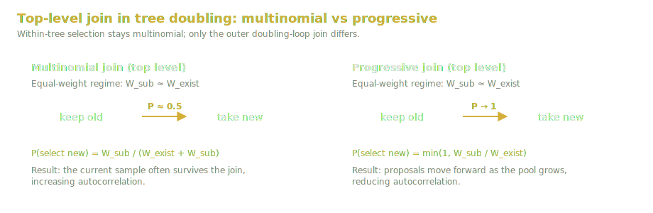
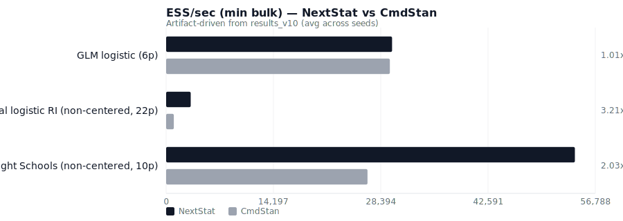
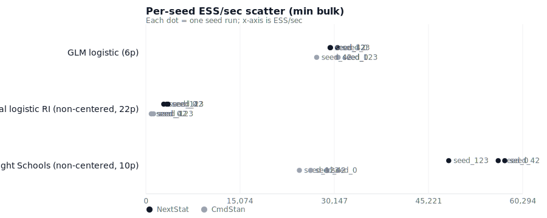

# NextStat NUTS v10: Progressive Sampling, ESS/Leapfrog Diagnostics, and Reproducible Benchmarks

**Version:** 0.1.0 (Draft)  
**Authors:** NextStat Contributors  
**Date:** February 2026  

---

## Abstract

We report a NUTS (No-U-Turn Sampler) implementation in NextStat (Rust core,
Python API) and a benchmark protocol designed to make Bayesian performance
numbers reproducible and comparable across frameworks.  We introduce an
algorithmic diagnostic, **ESS/leapfrog**, that factors out wall-time effects and
isolates sampler efficiency per unit of Hamiltonian integration.  Using this
metric, we identify and fix a proposal-selection mismatch in the tree-doubling
loop by implementing **progressive sampling** at the top level.  On a standard
logistic regression posterior, ESS/leapfrog improves from 57% to 117% relative
to a CmdStan baseline, and ESS/sec improves across three canonical geometries
(GLM, hierarchical non-centered, Eight Schools non-centered) under a fixed,
multi-seed protocol with strict health gates (divergences, treedepth saturation,
$\hat{R}$, ESS, E-BFMI).  We publish machine-readable artifacts (JSON schemas
and run outputs) to enable third-party replication.

---

> **TL;DR**
> - NextStat NUTS v10 keeps standard within-tree multinomial selection, but fixes the *top-level join* in the doubling loop via **progressive sampling**.
> - This change materially improves algorithmic efficiency (**ESS/leapfrog**) and translates into strong wall-time ESS/sec gains (up to **3.21x** on a hierarchical non-centered posterior).
> - Benchmarks are reproducible: fixed seeds, strict health gates, and published machine-readable artifacts.
>
> **Try NextStat**
> - WASM Playground: `/playground`
> - Python: `pip install nextstat` (docs: `/docs/installation`)
> - Source: https://github.com/NextStat/nextstat.io

## 1. Introduction

Bayesian performance claims are only meaningful when the *posterior* and the
*inference protocol* are pinned.  In practice, cross-framework comparisons
regularly fail because:

- the model differs subtly (priors, transforms, parameterization),
- adaptation defaults differ (step size, mass matrix windows, target accept),
- diagnostics are computed differently, or
- wall-time reflects process orchestration rather than sampler quality.

NextStat addresses these issues with:

1. an explicit posterior contract (model + priors + transforms),
2. a sampler implementation with documented settings, and
3. a benchmark harness that emits schema-valid artifacts for every run,
   including failures and missing optional backends.

This paper focuses on NUTS and the benchmark methodology; HistFactory model
details are specified separately in the NextStat model specification [10].

### Contributions

This paper makes three practical contributions:

1. A benchmark protocol and artifact format for Bayesian ESS/sec comparisons
   with explicit health gates and multi-seed stability.
2. An efficiency decomposition that uses **ESS/leapfrog** to isolate algorithmic
   sampling quality from wall-time implementation effects.
3. A Stan-compatible NUTS v10 implementation that uses **progressive sampling**
   in the top-level tree-doubling join step, materially improving ESS/leapfrog
   on GLM and hierarchical posteriors.

---

## 2. Background: Standard NUTS (Within-Tree Multinomial; Top-Level Join)

We assume Euclidean-metric HMC with position $q \in \mathbb{R}^D$ and momentum
$p \in \mathbb{R}^D$, with Hamiltonian

$$
H(q, p) = U(q) + K(p), \quad U(q) = -\log \pi(q), \quad K(p) = \tfrac{1}{2} p^T M^{-1} p,
$$

where $\pi(q)$ is the target density in unconstrained space and $M$ is the mass
matrix.  A leapfrog integrator proposes a trajectory $\{(q_i, p_i)\}$ with an
energy error $\Delta H_i = H(q_i, p_i) - H(q_0, p_0)$ relative to the initial
state.

### 2.1 Multinomial weights

In the multinomial variant of NUTS, each leaf is assigned an (unnormalized)
weight

$$
w_i = \exp(-\Delta H_i).
$$

The within-tree proposal is selected proportionally to these weights (a
categorical draw over the leaves), and subtrees are merged with a numerically
stable `log_sum_exp` accumulation.

### 2.2 Generalized U-turn criterion

We use the generalized no-U-turn criterion based on momentum sums (Betancourt
2017) rather than position differences.  Operationally, at each subtree merge we
apply three checks (full trajectory and two cross-boundary checks) to stop
growth when the trajectory begins to reverse direction; see the algorithm note
in `docs/references/nuts-sampler.md`.

---

## 3. Progressive Sampling in the Tree-Doubling Loop

NUTS builds a trajectory by repeatedly doubling the tree in a random direction.
At each doubling step we have:

- an existing tree with total weight $W_\mathrm{exist}$ and a sample
  $z_\mathrm{sample}$ drawn from the existing tree's multinomial distribution,
- a new subtree with total weight $W_\mathrm{sub}$ and a sample
  $z_\mathrm{propose}$ drawn from the subtree's multinomial distribution.

Within the recursive tree builder, merging two subtrees uses the multinomial
update:

$$
\Pr(\text{select right subtree}) = \frac{W_\mathrm{right}}{W_\mathrm{left} + W_\mathrm{right}}.
$$

Within-tree selection stays **multinomial**.  At the **top level** (the outer
doubling loop), we use **progressive sampling** for the join step:

$$
\Pr(z_\mathrm{sample} \leftarrow z_\mathrm{propose})
= \min\left(1, \frac{W_\mathrm{sub}}{W_\mathrm{exist}}\right).
$$

This update biases selection away from retaining the initial point as the
proposal pool grows.  A detailed discussion of the progressive sampling scheme
for multinomial NUTS is provided by Betancourt [2, Appendix A.3.2], and the
scheme is used in practical NUTS implementations [3, 4, 5].

### 3.1 Why this matters (equal-weight regime)

On well-conditioned posteriors with a well-adapted step size, subtree weight
magnitudes are often comparable.  In the equal-weight limit
$W_\mathrm{sub} \approx W_\mathrm{exist}$:

- multinomial joining yields a replace probability near 0.5, so the current
  sample remains in the proposal pool frequently,
- progressive joining yields replace probability 1, which aggressively moves
  the proposal forward as new trajectory mass is explored.

Empirically, this difference can dominate **ESS/leapfrog** while leaving other
trajectory-level diagnostics unchanged (step sizes, accept rates, tree depths,
total leapfrog counts).



Intuition: if the sampler repeatedly keeps the current sample at the top-level
join, it effectively reduces net displacement per iteration even when it
integrates a similar Hamiltonian path length; progressive joining pushes the
proposal forward as new trajectory mass is explored, reducing lag
autocorrelation.

---

## 4. Diagnostics and the ESS/Leapfrog Decomposition

### 4.1 Health gates (a run must be "allowed to exist")

We report performance only for runs that pass baseline health checks:

- divergence rate (thresholded),
- treedepth saturation rate,
- rank-normalized $\hat{R}$,
- minimum bulk/tail ESS,
- minimum E-BFMI.

These metrics are computed in the NextStat core and exported as JSON.

### 4.2 ESS/sec

For each benchmark case we report a conservative ESS/sec proxy:

$$
\mathrm{ESS/sec} = \frac{\min_j \mathrm{ESS}_\mathrm{bulk}(j)}{T_\mathrm{wall}},
$$

where $j$ indexes parameters and $T_\mathrm{wall}$ includes warmup and sampling.
This matches the "publishable snapshot" philosophy: a wall-time number without a
quality gate is not evidence.

### 4.3 ESS/leapfrog

Wall time conflates:

- algorithmic sampling efficiency, and
- per-leapfrog computational cost (autodiff overhead, process orchestration,
  language runtime overhead, BLAS backend, etc.).

To isolate algorithmic behavior we define:

$$
\mathrm{ESS/leapfrog} = \frac{\min_j \mathrm{ESS}_\mathrm{bulk}(j)}{N_\mathrm{LF}},
$$

where $N_\mathrm{LF}$ is the total number of leapfrog steps executed across all
chains and draws.  When two implementations have similar tree depth profiles and
similar $N_\mathrm{LF}$ but different ESS/leapfrog, the difference must come
from proposal selection and/or accept/reject dynamics rather than "how much HMC
work was done".

NextStat uses ESS/leapfrog as a first-line diagnostic for "algorithmic parity"
before interpreting ESS/sec.

---

## 5. Implementation Notes (NextStat)

NextStat's NUTS implementation is in `crates/ns-inference/src/nuts.rs` and
builds on:

- `crates/ns-inference/src/hmc.rs`: leapfrog integrator and Euclidean metrics
  (diagonal and dense via Cholesky of $M^{-1}$),
- `crates/ns-inference/src/adapt.rs`: windowed warmup and dual averaging,
- `crates/ns-inference/src/diagnostics.rs`: $\hat{R}$, ESS, E-BFMI.

For numerical stability, subtree joins are implemented in log-space with a
NaN-safe `log_sum_exp` and stable selection probability computation.

### 5.1 Code sketch (top-level join)

The key change is localized: the *within-tree* merge uses the standard
multinomial update, while the *outer* join uses progressive selection:

```rust
// crates/ns-inference/src/nuts.rs
// exp(logW_sub - logW_exist) clamped to [0,1] (progressive sampling).
let p = prob_select_outer_progressive(tree.log_sum_weight, subtree.log_sum_weight);
if rng.random::<f64>() < p {
    tree.q = subtree.q;
}
```

---

## 6. Benchmark Protocol

### 6.1 Cases

We use a small baseline set intended to cover distinct NUTS regimes:

1. **GLM logistic regression (6 parameters)**: well-conditioned baseline.
2. **Hierarchical logistic random intercept (22 parameters, non-centered)**:
   funnel-like geometry.
3. **Eight Schools (10 parameters, non-centered)**: classic hierarchical
   benchmark.

### 6.2 Settings

All cases use:

- 4 chains
- 1000 warmup, 2000 samples
- diagonal metric
- `target_accept = 0.8` (Eight Schools uses 0.95 by design)
- fixed generated dataset seed (`dataset_seed = 12345`) and chain seeds
  `{42, 0, 123}`

### 6.3 Artifacts and schemas

Each run emits:

- a per-case JSON artifact under `nextstat.bayesian_benchmark_result.v1`,
- a suite index JSON under `nextstat.bayesian_benchmark_suite_result.v1`,
- an aggregated multi-seed report (`bayesian_multiseed_summary.{json,md}`).

The v10 results described below are checked into:

`benchmarks/nextstat-public-benchmarks/suites/bayesian/results_v10/`.

---

## 7. Results (February 2026)

Hardware: AMD EPYC 7502P (32C/64T), 128 GB RAM.  CmdStan baseline version:
2.38.0 (released 2026-01-13 [5]).  All runs meet health gates: 0 divergences
and max $\hat{R} < 1.01$.

<!-- AUTOGEN:V10_RESULTS_BEGIN -->

This section is generated from checked-in benchmark artifacts:

- Artifacts: `benchmarks/nextstat-public-benchmarks/suites/bayesian/results_v10`
- Dataset seed: `12345` (fixed)
- Chain seeds: `0, 42, 123`
- Config: `4` chains, `1000` warmup, `2000` samples, diagonal metric

### 7.1 ESS/sec (avg across seeds)

| Model | NextStat ESS/sec | CmdStan ESS/sec | Ratio |
|---|---:|---:|---:|
| GLM logistic (6p) | 29,895 ± 667.7 | 29,600 ± 1,971 | 1.01x |
| Hierarchical logistic RI (non-centered, 22p) | 3,255 ± 360.2 | 1,015 ± 188.5 | 3.21x |
| Eight Schools (non-centered, 10p) | 54,083 ± 4,902 | 26,644 ± 2,221 | 2.03x |

Figures (generated):





### 7.2 Health gates (worst across seeds)

| Model | Backend | Divergences | Max treedepth hits | Max R-hat | Min E-BFMI |
|---|---|---:|---:|---:|---:|
| GLM logistic (6p) | nextstat | 0 | 0 | 1.001 | 1.011 |
| GLM logistic (6p) | cmdstanpy | 0 | 0 | 1.002 | — |
| Hierarchical logistic RI (non-centered, 22p) | nextstat | 0 | 0 | 1.004 | 0.691 |
| Hierarchical logistic RI (non-centered, 22p) | cmdstanpy | 0 | 0 | 1.002 | — |
| Eight Schools (non-centered, 10p) | nextstat | 0 | 0 | 1.003 | 0.883 |
| Eight Schools (non-centered, 10p) | cmdstanpy | 0 | 0 | 1.002 | — |

### 7.3 ESS/leapfrog (algorithmic efficiency)

This diagnostic isolates sampler efficiency per unit of Hamiltonian integration.

| Case | NextStat | CmdStan | Ratio |
|---|---:|---:|---:|
| GLM logistic (6p) | 0.187 ± 0.006 | 0.164 ± 0.002 | 1.14x |
| Hierarchical logistic RI (non-centered, 22p) | 0.044 ± 0.009 | 0.024 ± 0.005 | 1.82x |
| Eight Schools (non-centered, 10p) | 0.052 ± 0.003 | 0.046 ± 0.004 | 1.14x |

Note: ESS is computed via `arviz_ess_bulk_min` (supplementary; not part of v1 public schemas).
Note: Leapfrog totals are summed over post-warmup draws (`n_leapfrog__` / `sample_stats.n_leapfrog`).

### 7.4 ESS/sec decomposition (implied)

Using the identity: (ESS/sec ratio) ≈ (ESS/LF ratio) × (LF/sec ratio).

| Case | ESS/sec ratio | ESS/LF ratio | Implied LF/sec ratio |
|---|---:|---:|---:|
| GLM logistic (6p) | 1.01x | 1.14x | 0.88x |
| Hierarchical logistic RI (non-centered, 22p) | 3.21x | 1.82x | 1.76x |
| Eight Schools (non-centered, 10p) | 2.03x | 1.14x | 1.78x |

<!-- AUTOGEN:V10_RESULTS_END -->


---

## 8. Discussion

### 8.1 What changed in v10

In v9, trajectory-level diagnostics (step size, acceptance, tree depth) matched
closely, but ESS/leapfrog was substantially lower on a GLM posterior.  This
pinpointed a proposal-selection issue rather than an integration or adaptation
issue.  Switching the top-level join to progressive sampling substantially
improved ESS/leapfrog and improved ESS/sec across all tested geometries.

### 8.2 Decomposing performance: algorithm vs wall-time

ESS/sec is the user-facing metric, but it mixes two effects:

- algorithmic efficiency: ESS/leapfrog (Table 7.3), and
- implementation cost per leapfrog (autodiff, vectorization, orchestration).

Concretely, for a fixed benchmark protocol:

$$
\frac{\mathrm{ESS/sec}_{NS}}{\mathrm{ESS/sec}_{Stan}} \approx
\frac{\mathrm{ESS/LF}_{NS}}{\mathrm{ESS/LF}_{Stan}} \times
\frac{\mathrm{LF/sec}_{NS}}{\mathrm{LF/sec}_{Stan}}.
$$

Table 7.3 supplies the first factor directly; the remaining gap (if any) is the
implied per-leapfrog throughput difference.  This is why it is essential to
report both ESS/sec and ESS/leapfrog: the former answers "how fast is it on this
setup", while the latter answers "is the sampler doing better HMC per unit of
integration".

### 8.3 Threats to validity

Even with a pinned protocol, cross-framework comparisons remain sensitive to:

- gradient implementation differences (analytical vs AD),
- process orchestration overhead (single-process vs multi-process chains),
- CPU vectorization and BLAS configuration,
- parameterization (centered vs non-centered).

We treat these as part of the experimental context and publish full artifacts so
others can rerun the exact protocol.

---

## 9. Conclusion

ESS/leapfrog is an effective diagnostic to separate algorithmic sampling quality
from wall-time implementation costs.  Under a fixed multi-seed benchmark
protocol, a single proposal-selection change (top-level progressive sampling)
substantially improved sampler efficiency and yields strong ESS/sec results on
hierarchical posteriors.

---

## Call to Action

- Try the interactive WASM Playground: `/playground`
- Install NextStat for Python: `pip install nextstat` (installation guide: `/docs/installation`)
- Star the repo / inspect the artifacts: https://github.com/NextStat/nextstat.io

## References

[1] Hoffman, M. D., Gelman, A. *The No-U-Turn Sampler: Adaptively Setting Path Lengths in Hamiltonian Monte Carlo.* JMLR 15(1), 1593–1623 (2014).  
[2] Betancourt, M. *A Conceptual Introduction to Hamiltonian Monte Carlo.* arXiv:1701.02434 (2017).  
[3] Carpenter, B., Gelman, A., Hoffman, M. D., et al. *Stan: A Probabilistic Programming Language.* Journal of Statistical Software 76(1) (2017). DOI: 10.18637/jss.v076.i01.  
[4] Stan Development Team. *Stan Reference Manual.* Version 2.38. https://mc-stan.org/docs/reference-manual/ (accessed February 2026).  
[5] Stan Development Team. *Release of CmdStan 2.38.* January 13, 2026. https://blog.mc-stan.org/2026/01/13/release-of-cmdstan-2-38/ (accessed February 2026).  
[6] Vehtari, A., Gelman, A., Simpson, D., Carpenter, B., Bürkner, P.-C. *Rank-normalization, folding, and localization: An improved $\hat{R}$ for assessing convergence of MCMC.* Bayesian Analysis (2021).  
[7] Geyer, C. J. *Practical Markov Chain Monte Carlo.* Statistical Science 7(4), 473–483 (1992).  
[8] Langenbruch, Christoph. *MoreFit: A More Optimised, Rapid and Efficient Fit.* arXiv:2505.12414 (2025).  
[9] Stan Development Team. *CmdStan 2.38.0 (GitHub release).* https://github.com/stan-dev/cmdstan/releases/tag/v2.38.0 (accessed February 2026).  
[10] NextStat Contributors. *NextStat Model Specification: HistFactory Probability Densities and Modifiers.* `docs/papers/model-specification.md` (2026).
