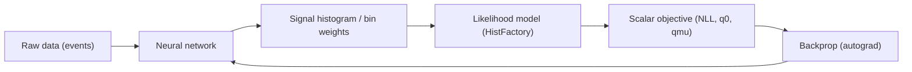

# E2E Pipeline: ML -> Likelihood -> Significance (When and Why)

This page explains the end-to-end (E2E) workflow where a learned model produces
physics/statistics inputs that are scored by a *likelihood* (HistFactory-style),
and training is driven by a statistically meaningful objective (e.g. profiled
discovery significance).

If you want implementation details, start here:
- Differentiable HistFactory layer for PyTorch: `docs/differentiable-layer.md`
- GPU parity / tolerance contract: `docs/gpu-contract.md`

## What "E2E" Means Here

The E2E pattern is:

1. A neural network maps raw events -> a representation (often a binned histogram or a set of bin weights).
2. That representation becomes the *signal model* (or a component of the expected yields).
3. NextStat evaluates a likelihood-based objective and returns a scalar loss.
4. Backprop updates the neural net.

Typical objective families:
- Fixed-parameter objective: `NLL(data | params)` with nuisance parameters held fixed.
- Profiled objective: `q0` / `qmu` where nuisance parameters are profiled (optimized) inside the forward pass.

## When This Applies (Good Fit)

Use an E2E likelihood objective when:

- Your evaluation metric is inherently likelihood-based (discovery significance, profile likelihood ratios, etc.).
- You care about nuisance parameters and constraints (systematics) during optimization, not only at evaluation time.
- You want the model to optimize for *physics utility* rather than proxy ML metrics (AUC, accuracy) that may not align with inference.

It is most compelling when:
- The inference step is expensive enough that doing it post-hoc for many candidate models is impractical.
- You can amortize inference by moving it into the training loop with GPU acceleration.

## When It Does NOT Apply (Common Misfits)

Avoid (or be cautious) when:

- The statistical model is incomplete or intentionally simplified: training will optimize the wrong objective.
- The final result requires non-differentiable steps (hard selections, discrete choices) without a relaxed surrogate.
- You need full CLs bands or limits as a training target: those generally involve root-finding and/or toy ensembles and are not currently treated as differentiable training objectives.

## Interpreting "Significance" During Training

Treat training-time significance as an *optimization signal*, not a discovery claim.

Key points:
- `Z0` is typically a *local* discovery significance (no look-elsewhere correction).
- If you scan many hypotheses/windows/features, you must control trial factors at the analysis level.
- Overfitting can inflate apparent significance; always validate on held-out data and through closure tests.

## Validation Checklist (Minimum)

1. **Objective parity**:
   - Verify CPU reference vs GPU path is within the GPU contract tolerances (`docs/gpu-contract.md`).
2. **Closure**:
   - Train on synthetic data generated from the same model and verify recovery of known parameters / expected behavior.
3. **Robustness**:
   - Check sensitivity to optimizer tolerances and initialization (especially when profiling nuisance parameters).
4. **Generalization**:
   - Evaluate on held-out data and report both ML diagnostics and inference diagnostics (fit convergence, pulls/constraints, stability of q(mu)).

## Practical Notes (Engineering)

- Prefer deterministic execution for evaluation and regression tests (tool execution `eval_mode="parity"` / single-threaded reference path).
- For GPU training loops:
  - CUDA: f64 compute is available and matches CPU precision more closely.
  - Metal: compute is typically f32; expect larger numerical tolerances and validate stability explicitly.

## References

- `docs/differentiable-layer.md`
- `docs/gpu-contract.md`
- `docs/pyhf-parity-contract.md`

